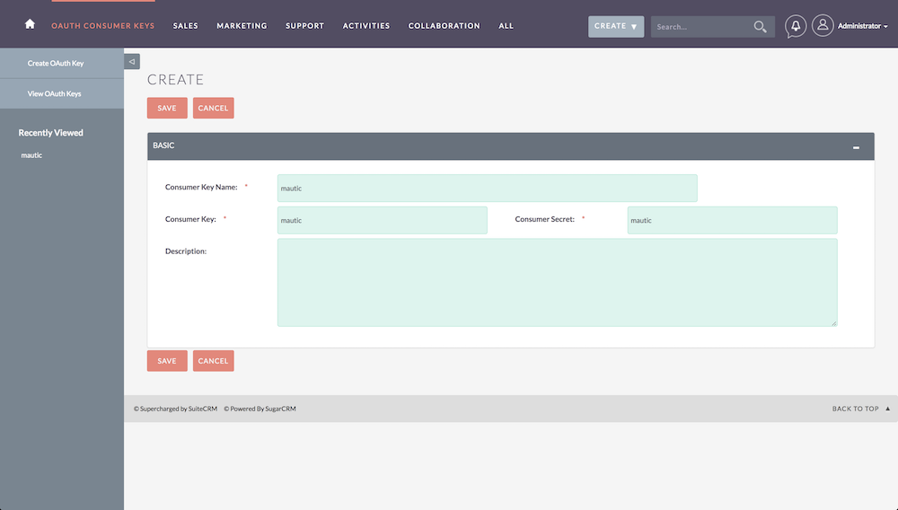
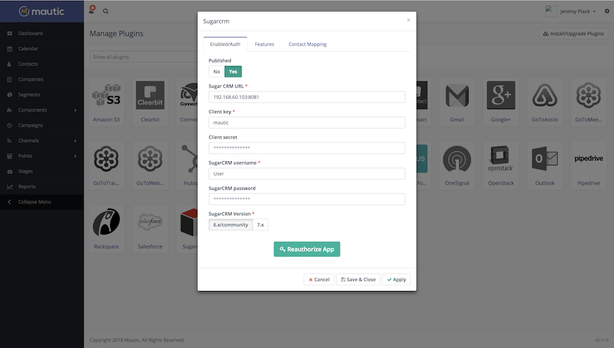
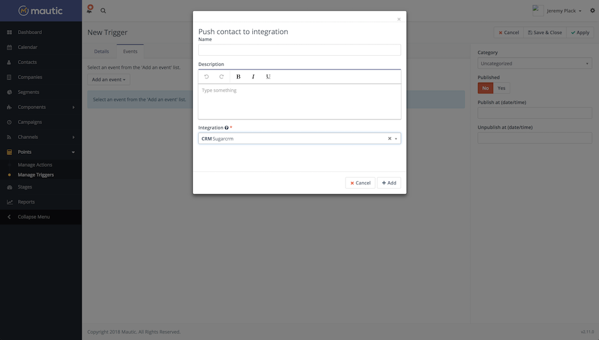
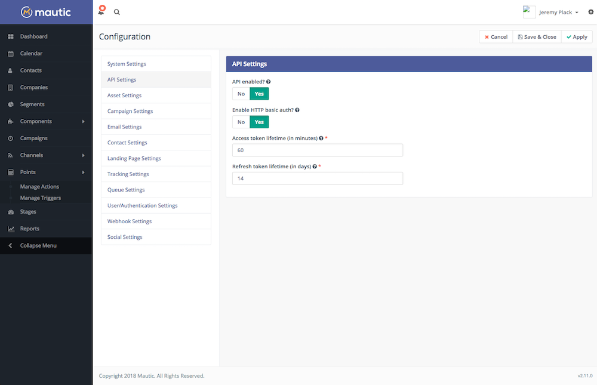
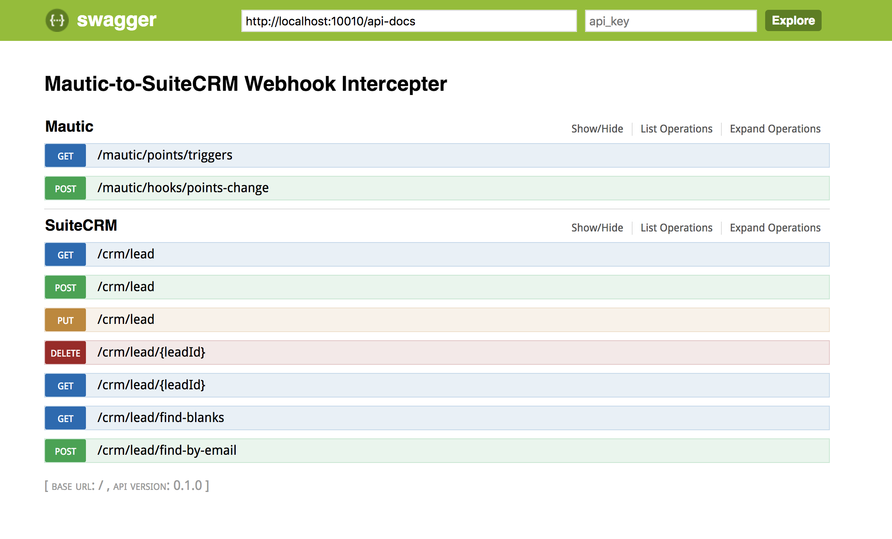
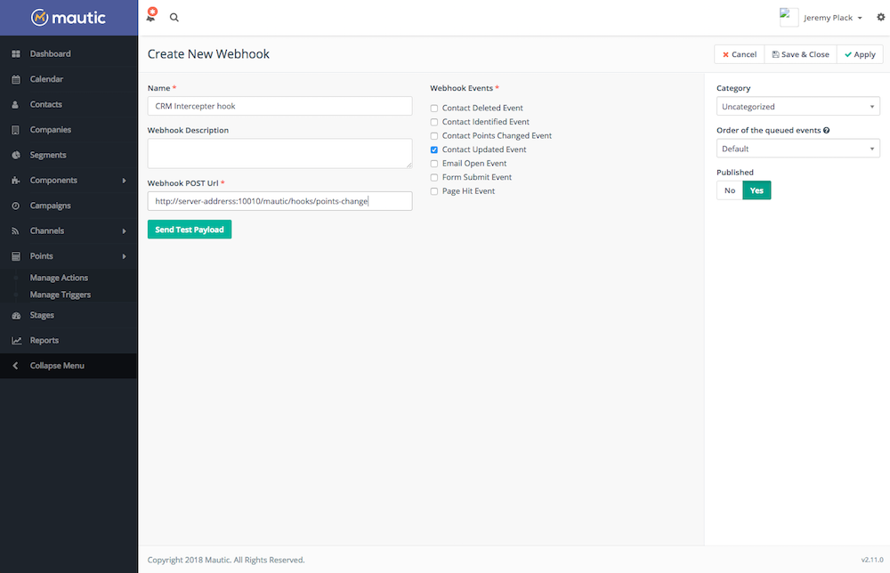
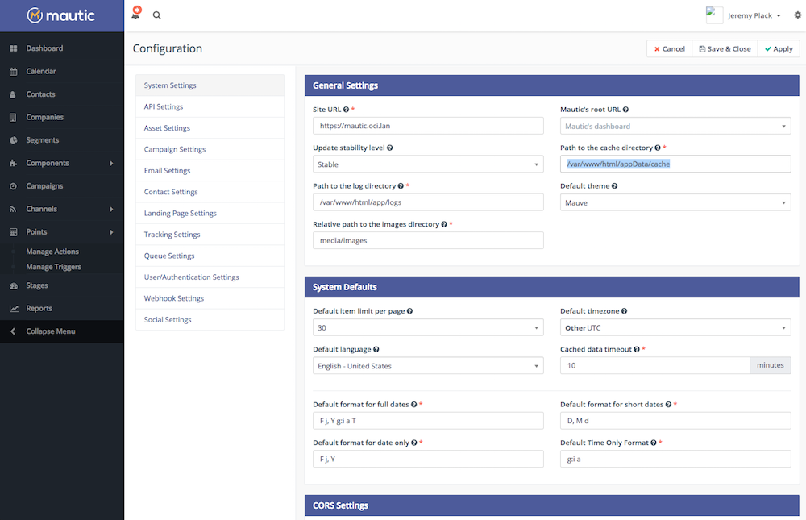

# Mautic-to-SuiteCRM Webhook Intercepter

This project is designed to provide a NodeJS web server for responding to Mautic webhook events and aims to provide RESTful JS clients to the Mautic and SuiteCRM APIs to advance Javascript development with these tools.
was started to work-around a limitation in Mautic's SugarCRM integration plugin when using SuiteCRM.

---

## Getting started

### Prerequisites

Before using this project you will need running instances of Mautic and SuiteCRM that are network accessible. You will then need to configure Mautic to integrate with SuiteCRM and the Intercepter.

1. Install the SuiteCRM plugin:
  - Create an oAuth key in SuiteCRM:
  

  - Authenticate Mautic SugarCRM plugin and configure Contact Mapping:
  
  This will handle the initial push to crm based on the lowest value point trigger configured in Mautic.

2. Set up Mautic point trigger:
  - 

### Configuration

The next step is to launch the Intercepter server and configure the webhook in Mautic.

1. Clone the project:
  - `git clone url`
2. Configure settings:
  - `cd path && ./setup.sh`
3. Configurer Mautic API Settings:
  - 
4. Start the server:
  - `npm install`
  - `npm start`
5. Test Swagger endpoints:

  - [http://server-address:10010/docs/#!](http://server-address:10010/docs/#!)
    
    The SuiteCRM endpoints and the Mautic point-triggers endpoint should be working now.

6. Configure the webhook settings in Mautic:
  - [https://mautic-url.com/s/webhooks/1](https://mautic-url.com/s/webhooks/1)
  make sure "Contact Update Event" is selected:
  

7. Test the webhook:
  - Create new contact in Mautic with 50 points and at least an e-mail address.
  - Verify contact is created in SuiteCrm.
  - Modify contact information in Mautic and increase the points value.
  - Verify that contact information has been updated in SuiteCRM.

### Debugging:

If you don't see the behavior above then check the swagger endpoints again and look to the webhook logs in Mautic and the Intercepter log file (`path/to/project/log/application.log`). There is likely an issue with the Mautic cache, you should clear the cache, and in the Mautic configuration settings, change the cache dir to a new directory on the same level as `/var/www/html/app/`.
  - `php app/console cache:clear`

  - 

## Docker Compose

Here is a link to a complete environment set up with Mautic, SuiteCRM, the webhook intercepter, and nginx, orchestrated with docker-compose.

[github url](github url)
